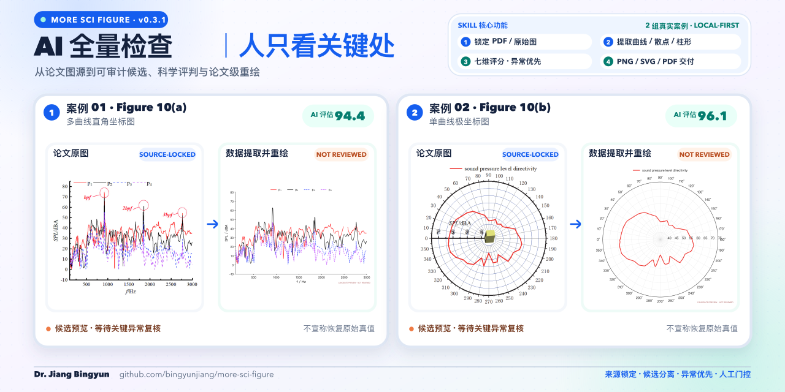
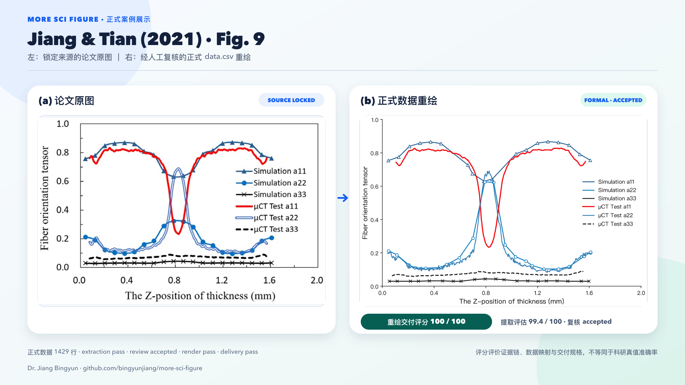
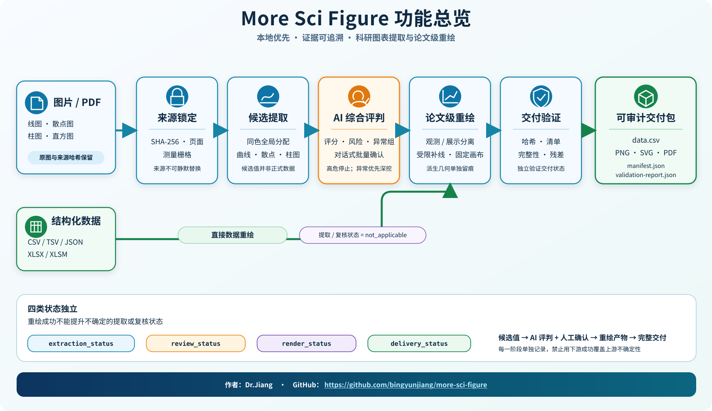
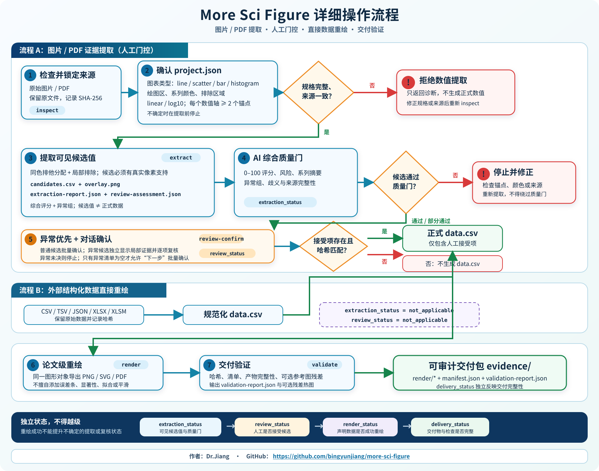

# More Sci Figure

**让 AI 检查整张科研图，让你只判断关键异常。**

[](CHANGELOG.md)
[](requirements.txt)
[](#为什么值得信任)
[](LICENSE)
[](SKILL.md)
[](SKILL.md)
[](SKILL.md)

版本：v0.3.1

[](assets/more-sci-figure-promo-16x9.png)

More Sci Figure 是一个面向科研人员、工程师和论文作者的 Agent Skill。它从图片、PDF 或已有数据中提取科研图表信息，自动评估质量和异常，经过必要复核后生成可编辑数据与论文级 PNG、SVG、PDF。

你不需要逐点校对大量数据，也不需要自己运行一串命令。把图表交给 Codex 等 Agent，查看综合评判，按提示回复“下一步”即可。

> **English summary:** A local-first, auditable Agent Skill for scientific chart digitization, anomaly-first review, publication-ready redraws, and PNG/SVG/PDF delivery.

**关键词 / Keywords：** 科研图表数字化 · scientific chart digitization · PDF 图表数据提取 · 曲线/散点/柱图 · polar plot · AI 质量评估 · anomaly-first review · 论文级重绘 · SVG/PDF · local-first · auditable workflow

## More 系列

More 系列是一组面向真实创作与研究任务的开源 Agent Skills。每个项目都强调本地优先、过程透明和结果可追溯。

| 项目 | 主要用途 |
| --- | --- |
| [**more-sci-figure**](https://github.com/bingyunjiang/more-sci-figure) · 当前项目 | 科研图表数据提取、异常优先复核、论文级重绘与验证 |
| [more-paper-workflow](https://github.com/bingyunjiang/more-paper-workflow) | 从选题、检索、文献管理到写作与引用审计的论文证据闭环 |
| [more-news-briefing](https://github.com/bingyunjiang/more-news-briefing) | 新闻和行业信息的收集、去重、核验与结构化简报 |
| [more-comic-digitizer](https://github.com/bingyunjiang/more-comic-digitizer) | 保护原作、作者权和隐私的儿童手绘漫画数字化工作流 |

[查看 Dr. Jiang Bingyun 的全部开源项目](https://github.com/bingyunjiang)

[查看正式案例](#正式案例) · [立即开始](#两分钟开始) · [了解核心能力](#你可以用它做什么) · [开发者文档](#开发者文档)

---

## 它解决什么问题

| 传统工作方式 | More Sci Figure |
| --- | --- |
| 对着论文图表逐点读数 | 自动提取曲线、散点、柱形和极坐标数据 |
| 用户检查成百上千个候选点 | AI 先做七维评估，只展示高风险异常区 |
| 不知道重绘是否漏线、串线或改了数据 | 保留来源、候选、复核、正式数据和重绘的完整证据链 |
| 只能得到一张不可编辑截图 | 同时交付 CSV、PNG、SVG 和 PDF |
| 高总分掩盖某条失败曲线 | 总分、最低维度、最差曲线和硬门分别判定 |

## 你可以用它做什么

### 1. 从论文图片或 PDF 提取数据

锁定原始图源和 SHA-256，标定直角坐标或极坐标，提取可见的曲线、散点、柱图和直方图数据。

### 2. 自动识别最值得检查的位置

Agent 综合分析来源、标定、像素支持、曲线连续性、不确定度和异常负担。普通候选批量处理，异常候选单独展示，不再让用户逐点翻阅整张表。

### 3. 处理复杂科研图表

支持同色实线/虚线分离、图内图例排除、连续曲线上的真实标记中心、PDF 嵌入图像以及单值径向极坐标曲线。

### 4. 生成论文级可编辑图表

正式数据确定后统一输出 PNG、SVG 和 PDF。线型、颜色和标记属于表现层，不会在重绘阶段偷偷修改数据拓扑。

### 5. 直接重绘已有数据

CSV、TSV、JSON、XLSX 或 XLSM 可以绕过图像提取，直接规范化并生成图表；此时提取和人工复核状态明确标记为 `not_applicable`。

### 6. 保存可追溯证据

来源、规格、候选值、复核决定、正式观测、正式数据和最终交付分别保存。任何哈希、质量门或复核覆盖不一致都会停止流程。

## 适合谁

- 需要从论文图表恢复可分析数据的科研人员；
- 需要重绘低清晰度或不可编辑图表的论文作者；
- 需要把历史图片曲线转成 CSV 的工程师；
- 需要批量筛查异常、但没有精力逐点校对的团队；
- 需要 PNG、SVG、PDF 与证据记录同时交付的研究项目。

## 两分钟开始

### 面向普通用户：直接告诉 Agent

上传图片或 PDF，然后发送：

```text
请使用 more-sci-figure 处理这张科研图表。
先锁定原始图源并向我展示规格确认图；确认后提取数据，
用综合评分和异常区告诉我是否可继续，不要让我逐点校对普通候选。
在安全门通过后生成正式 CSV，以及 PNG、SVG、PDF 重绘并验证。
```

之后的典型对话只有三步：

1. Agent 展示原图和规格叠图，你确认图对象、坐标和系列；
2. Agent 汇报总分、最低维度、最差曲线、硬门和异常区；
3. 风险允许时，你回复 **“下一步”**，Agent 完成复核应用、重绘与验证。

如果出现真正影响科研判断的歧义，Agent 只询问对应异常区，不把全部候选重新交给你。

### 面向开发者：本地运行

```bash
git clone https://github.com/bingyunjiang/more-sci-figure.git
cd more-sci-figure
python3 -m pip install -r requirements.txt
python3 scripts/more_sci_figure.py --help
```

作为 Agent Skill 使用时，将本目录放入对应的 skills 目录，并让 Agent 在运行前完整阅读 `SKILL.md`。

## 正式案例

### Jiang 和 Tian 2021 · Fig. 9

[](assets/case-figure9-original-vs-redraw.svg)

左侧为锁定的论文原图，右侧为经过候选提取、复核应用和交付验证后的正式重绘。两张图等宽、完整嵌入且不裁切。

| 项目 | 结果 |
| --- | ---: |
| 系列数量 | 6 |
| 正式数据 | 1,429 行 |
| 提取综合评估 | 99.4 / 100 |
| 最低提取维度 | 96.0 / 100 |
| 重绘技术交付评分 | 100 / 100 |
| 四阶段状态 | extraction `pass` · review `accepted` · render `pass` · delivery `pass` |

评分评价证据、质量门、文件、格式和数据映射，不等同于科研真值准确率或视觉审美评分。

[可编辑 SVG](assets/case-figure9-original-vs-redraw.svg) · [审计记录](assets/case-figure9-original-vs-redraw.json) · [正式 data.csv](examples/full-workflow-20260726/figure9-marker-v3/data.csv) · [PNG/SVG/PDF 重绘](examples/full-workflow-20260726/figure9-marker-v3/render/)

## 为什么值得信任

### 来源不会被静默替换

检查阶段记录原始文件 SHA-256、图像尺寸、PDF 页码、嵌入对象和测量栅格。来源变化后，已有确认立即失效。

### 候选不等于正式数据

```text
原图 → 规格确认 → candidates.csv → review-decisions.json
     → observations.csv → data.csv → PNG / SVG / PDF → validate
```

- `candidates.csv` 是算法候选；
- `observations.csv` 是复核接受的可见像素观测；
- `data.csv` 是拓扑已经确定的正式数据；
- 重绘成功不能反向提升提取或复核状态。

### 高分不能绕过硬门

来源与哈希、自动质量门、候选覆盖以及未决高危异常属于不可补偿硬门。即使综合分很高，任一硬门失败仍会停止。

### 本地优先

除非用户明确授权远程 OCR 或视觉服务，图源、候选、复核页面和交付文件都在本地处理。

### 不伪造图中没有的信息

工具不会猜测隐藏点、原始重复实验、误差条含义、作者模型、显著性、样本量或未声明单位。

## 工作原理

[](assets/more-sci-figure-overview.svg)

图像提取流程分为四个独立状态：

| 状态 | 回答的问题 |
| --- | --- |
| `extraction_status` | 可见候选是否通过自动质量门？ |
| `review_status` | 候选是否被接受、部分接受或拒绝？ |
| `render_status` | 正式数据是否成功生成目标图？ |
| `delivery_status` | 文件、哈希、格式和验证是否完整？ |

完整操作与拒绝分支见下图：

[](assets/more-sci-figure-workflow.svg)

## 支持范围

| 类别 | 当前支持 |
| --- | --- |
| 图源 | PNG、JPEG、TIFF、BMP、WebP、PDF |
| 外部数据 | CSV、TSV、JSON、XLSX、XLSM |
| 图表 | 折线、单值径向极坐标曲线、紧凑实心散点、竖直实色柱图、直方图 |
| 复杂系列 | 同色曲线、实线/虚线、局部排除框、连续线上的标记中心 |
| 输出 | CSV、PNG、SVG、PDF、JSON 审计记录、证据叠图与残差热图 |

旧版二进制 `.xls` 当前不支持。无法确认绘图区、坐标变换、有效锚点或系列分离时，工具只给诊断，不生成正式数值。

## 开发者文档

### CLI 命令

| 命令 | 功能 |
| --- | --- |
| `inspect` | 检查来源，锁定图像或 PDF 嵌入对象 |
| `spec-review` | 生成绘图区、锚点、系列和排除框叠图 |
| `spec-confirm` | 绑定用户确认语句、项目与来源哈希 |
| `extract` | 生成候选、证据叠图、质量报告和异常清单 |
| `review-assess` | 生成七维综合评分、硬门和下一步指令 |
| `review-confirm` | 将用户对话确认写入哈希绑定的复核记录 |
| `review-serve` | 启动本地异常深挖页面并保存决定 |
| `review-apply` | 生成 `observations.csv`、`data.csv` 和正式数据报告 |
| `preview` | 生成带水印候选预览，不推进正式状态 |
| `render` | 从正式数据输出 PNG、SVG 和 PDF |
| `validate` | 验证状态、哈希、产物、映射和可选参考残差 |
| `pipeline` | 按门控顺序执行，并在需要确认时暂停 |

```bash
python3 scripts/more_sci_figure.py COMMAND --help
```

### 七维提取评估

| 维度 | 权重 | 含义 |
| --- | ---: | --- |
| 来源与证据完整性 | 10% | 来源、项目和候选哈希是否完整 |
| 坐标标定质量 | 15% | 锚点和标定残差是否可靠 |
| 像素证据质量 | 20% | 候选是否具有真实像素支持 |
| 系列分离与连续性 | 20% | 最差曲线的覆盖、缺口和分离是否合格 |
| 不确定度与稳定性代理 | 15% | 坐标扰动与引导残差是否足够小 |
| 异常负担 | 10% | 异常比例和严重程度 |
| 项目质量门符合度 | 10% | 声明的自动检查通过比例 |

| 用途等级 | 总分合格线 | 任一维度最低分 |
| --- | ---: | ---: |
| `exploratory` | 85 | 75 |
| `engineering`（默认） | 90 | 85 |
| `publication` | 95 | 90 |

这些阈值是保守操作基线，不是统计准确率。论文用途仍需来源证据、人工复核与真实基准验证。

### 项目规格与 Schema

从 [项目模板](assets/project-template.json) 开始：

- [project.schema.json](schemas/project.schema.json)
- [review-assessment.schema.json](schemas/review-assessment.schema.json)
- [review-decisions.schema.json](schemas/review-decisions.schema.json)
- [validation-report.schema.json](schemas/validation-report.schema.json)

项目专用颜色、锚点、引导路径、坐标变换和质量门都保存在 `project.json`。引导点只限制像素搜索范围，不能直接成为候选数据。

### 主要交付物

```text
evidence/
├── project.json
├── source-report.json
├── spec-review.png
├── spec-confirmation.json
├── candidates.csv
├── overlay.png
├── extraction-report.json
├── review-assessment.json
├── review-anomalies.csv
├── review-uncertainty.csv
├── review.html
├── review-decisions.json
├── observations.csv
├── data.csv
├── formal-data-report.json
├── manifest.json
├── validation-report.json
└── render/
    ├── render.png
    ├── render.svg
    ├── render.pdf
    └── render-report.json
```

### 拒绝条件

以下情况不会生成正式数据：

- 图表类型、绘图区或坐标变换没有确认；
- 任一数值轴少于两个有效锚点；
- 来源、测量栅格或候选哈希不匹配；
- 图例、文字和数据标记无法可靠分离；
- 标记粘连、遮挡或歧义超出提取器能力；
- 复核缺失、覆盖不完整或全部候选被拒绝。

### 开发与验收

```bash
python3 -m unittest discover -s scripts/tests -p "test_*.py" -v
python3 scripts/release_acceptance.py
```

真实图表基准框架见 [benchmarks/README.md](benchmarks/README.md)。合成夹具只用于回归测试，不能冒充真实世界基准。

## 宣传素材

- [朋友圈 / B站 16:9 PNG](assets/more-sci-figure-promo-16x9.png)，2400 × 1350；
- [朋友圈 / B站可编辑 SVG](assets/more-sci-figure-promo-16x9.svg)；
- [GitHub / X 2:1 PNG](assets/more-sci-figure-promo-github-x.png)，1280 × 640；
- [GitHub / X 可编辑 SVG](assets/more-sci-figure-promo-github-x.svg)；
- [确定性海报生成脚本](scripts/generate_promo_poster.py)。

宣传海报使用真实图源和带状态标记的候选预览。未复核图表明确显示 `NOT REVIEWED`，不会包装成正式科研结论。

## 版本历史

按发布日期倒序排列：

- **v0.3.1 · 2026-07-26（当前版本）**
  - 默认复核改为 AI 七维综合评分、异常分组和对话式确认，逐点页面仅用于异常深挖。
  - 增加锚点稳定性、候选不确定度和 Agent/用户责任分流。
  - 将可见观测与正式数据拆分为 `observations.csv → data.csv`，重绘样式与数据拓扑解耦。
  - 增加正式 Fig. 9 案例、双案例宣传海报和面向用户的 README 首页。
- **v0.3.0 · 2026-07-26**
  - 增加 `guided_path`、同色系列排他式分配、局部排除框和实线/虚线语义质量门。
  - 增加候选坐标校正、系列重新归属、带水印预览和固定画布重绘。
- **v0.2.0 · 2026-07-25**
  - 建立 `candidates.csv → review-decisions.json → data.csv` 的人工复核闭环。
  - 增加候选哈希、本地中文复核页、项目质量门和四类独立状态。
- **v0.1.0 · 2026-07-24**
  - 首次发布来源检查、线图/散点/柱图提取、多格式重绘和基础验证。

完整记录见 [CHANGELOG.md](CHANGELOG.md)。

## 路线图

- **v0.4.0 计划**
  - 建立带来源、授权和标注协议的真实图表基准集；
  - 增加可审计 OCR 候选与半自动图例定位；
  - 增加更丰富的逐系列误检、漏检和残差指标；
  - 在真实基准证据充分后扩展更多图表类型。

## 贡献

新增提取器或检测规则时，请同时提交合成单元夹具、至少一个保留样例、原尺寸证据叠图、拒绝测试，以及对交付契约和状态模型的说明。

## 作者与联系

- 作者：Dr. Jiang Bingyun
- 微信：Bingyunjiang
- 邮箱：bingyunjiang@qq.com
- GitHub：[bingyunjiang/more-sci-figure](https://github.com/bingyunjiang/more-sci-figure)

## 许可证

本项目采用 [MIT License](LICENSE)。Copyright © 2026 Dr.Jiang。
